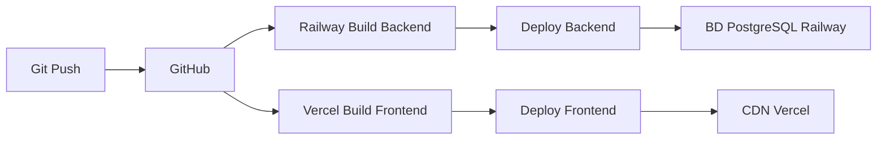
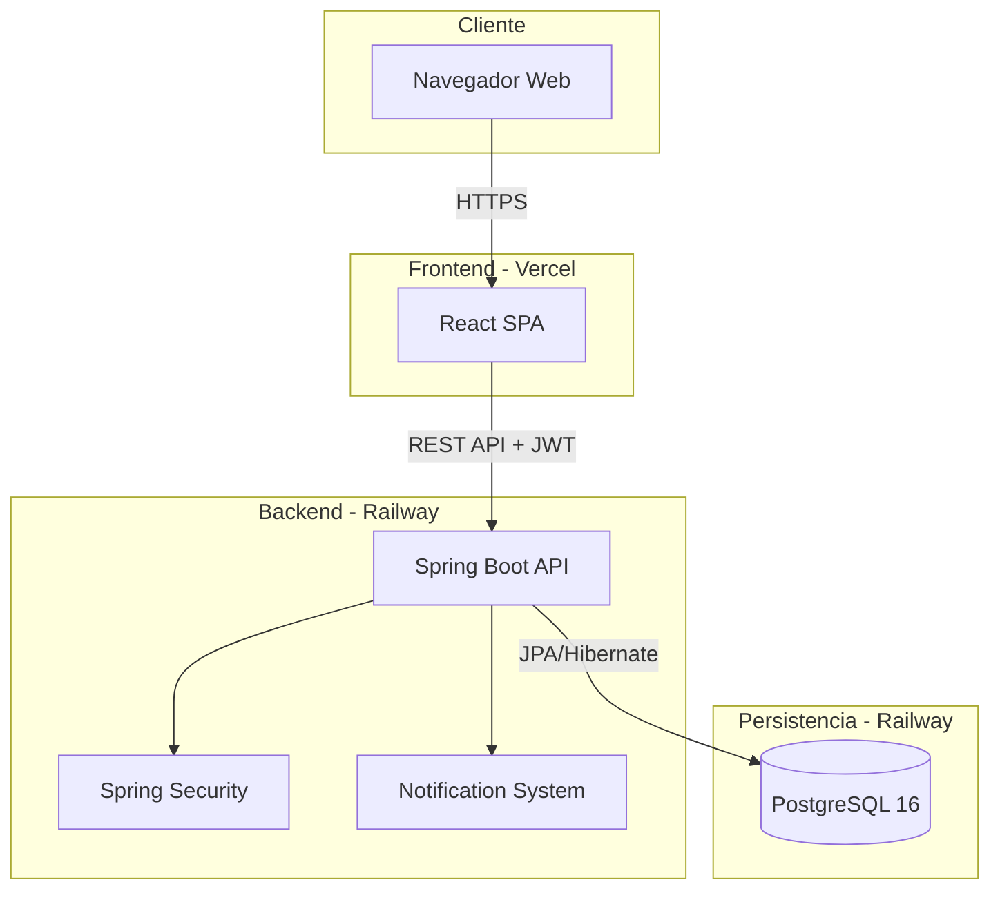
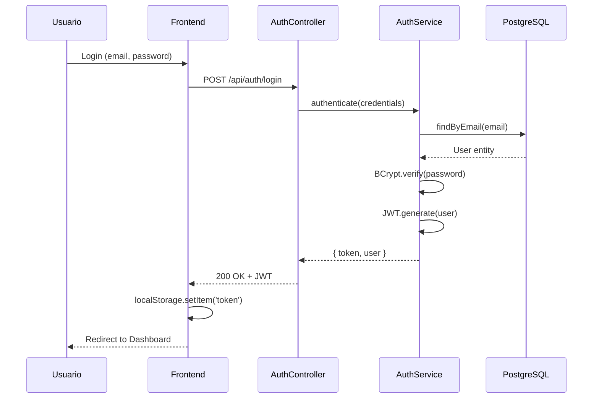
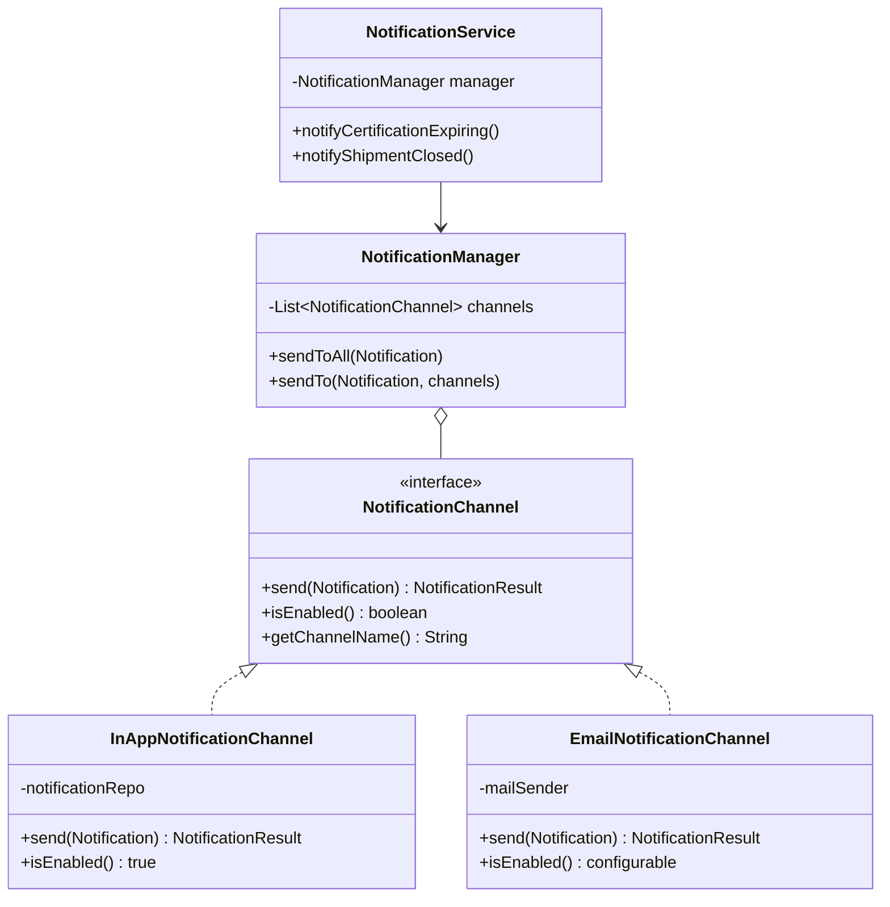
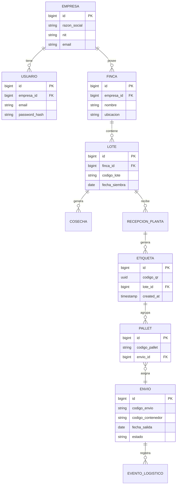
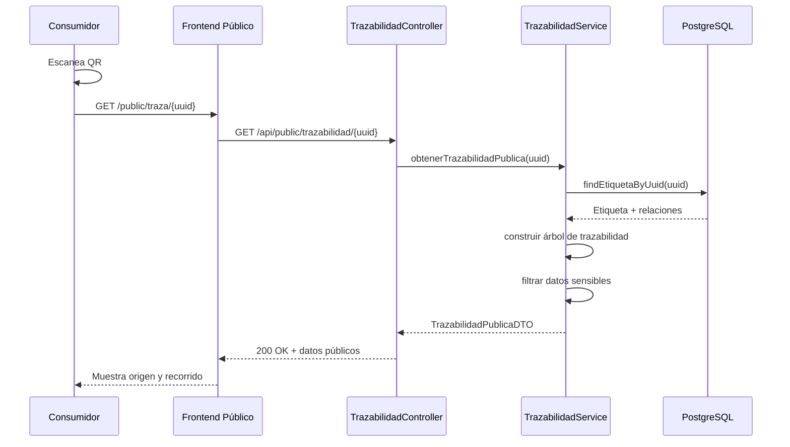

# Documento de Decisiones Técnicas y Arquitectónicas
## Plataforma Web de Trazabilidad para Exportación de Frutas en Colombia

**Fecha:** 20 de diciembre de 2025  
**Autores:** Ivan Dario Lombardi, Steven Eduardo Espinoza Mejía  
**Director TFM:** Jose María Suárez Peret

---

## 1. Introducción

Este documento presenta las decisiones técnicas adoptadas para el desarrollo de la plataforma web de trazabilidad agroexportadora, justificando las modificaciones realizadas sobre el alcance original, el stack tecnológico seleccionado y la estrategia de despliegue definida.

Las decisiones aquí documentadas buscan garantizar la viabilidad del proyecto dentro de las restricciones temporales de un Trabajo de Fin de Máster, manteniendo la calidad técnica y el cumplimiento de los objetivos académicos establecidos.

---

## 2. Ajustes al Alcance Funcional

### 2.1. Simplificación de Historias de Usuario

Se han revisado las historias de usuario originales del Product Backlog con el objetivo de optimizar el desarrollo sin comprometer la funcionalidad core del sistema. A continuación se detallan los principales ajustes:

#### HU-24: Integración con Sistemas Externos (ERP)

**Propuesta Original:**  
Integración bidireccional con ERP de la empresa para sincronización de datos.

**Decisión Adoptada:**  
Implementar exportación de datos en formatos estándar (CSV/JSON) mediante APIs REST documentadas con OpenAPI.

**Justificación:**
- La integración real con ERPs requiere análisis de múltiples sistemas propietarios.
- El tiempo de desarrollo estimado (20-30 horas) excede el alcance del TFM.
- La exportación de datos cumple el objetivo académico de demostrar interoperabilidad.

**Mitigación de Riesgos:**
- Diseño de APIs REST siguiendo estándares de mercado.
- Documentación automática con Swagger/OpenAPI.
- Endpoints preparados para consumo por sistemas externos.

#### HU-25: Notificaciones Automáticas

**Propuesta Original:**  
Sistema completo de notificaciones por email con tareas programadas.

**Decisión Adoptada:**  
Arquitectura extensible basada en patrón Strategy, con implementación inicial de notificaciones in-app y estructura preparada para integración futura de canales externos.

**Justificación:**
- Las notificaciones in-app cumplen el requisito funcional inmediato.
- La arquitectura extensible demuestra diseño de software a nivel profesional.
- La integración de email (SendGrid) queda preparada para activación posterior en 30-45 minutos.

**Componentes Implementados:**
- Interface `NotificationChannel` (patrón Strategy).
- `InAppNotificationChannel` funcional.
- `EmailNotificationChannel` como placeholder documentado.
- `NotificationManager` como orquestador.
- API REST para consulta de notificaciones desde frontend.

**Beneficio Técnico:**  
Diseño que cumple principios SOLID y demuestra capacidad de abstracción y extensibilidad, aspectos clave en ingeniería de software.

#### HU-26: Registro en Blockchain

**Propuesta Original:**  
Integración con red blockchain para inmutabilidad de hitos críticos.

**Decisión Adoptada:**  
Implementación de hash criptográfico (SHA-256) almacenado en base de datos, denominado "prototipo conceptual de blockchain".

**Justificación:**
- La integración con blockchain real (Hyperledger Fabric, Ethereum privada) requiere infraestructura compleja.
- El objetivo académico de demostrar inmutabilidad se cumple mediante hashing criptográfico.
- Se documentará como "prototipo" con línea de evolución hacia blockchain productiva.

**Implementación:**
- Generación de hash SHA-256 al cerrar lotes y envíos.
- Almacenamiento del hash en tabla de auditoría.
- Validación de integridad mediante comparación de hashes.

#### HU-19: Consulta Pública de Trazabilidad (QR)

**Propuesta Original:**  
Sistema completo de consulta pública con información detallada.

**Decisión Adoptada:**  
Vista pública simplificada con información básica, accesible mediante código QR sin autenticación.

**Justificación:**
- Cumple el objetivo de transparencia hacia el consumidor final.
- Protege información sensible empresarial.
- Facilita el despliegue en plataformas gratuitas (Vercel).

**Datos Expuestos:**
- País de origen, finca, fecha de cosecha.
- Variedad del producto.
- Estado general del envío.
- **No incluye:** datos económicos, contactos empresariales, información logística detallada.

### 2.2. Simplificación del Modelo de Datos: Contenedores

**Propuesta Original:**  
Relación N:M entre envíos y contenedores, permitiendo múltiples contenedores por envío y reasignación dinámica de pallets.

**Decisión Adoptada:**  
Modelo simplificado 1:1 entre Envío y Contenedor, con atributo `codigoContenedor` en la entidad Envío.

**Justificación:**
- En la práctica común de exportación de frutas, un envío estándar utiliza un contenedor principal.
- La complejidad de gestionar múltiples contenedores (validaciones, reasignaciones, capacidad) requiere 15-20 horas adicionales.
- La trazabilidad no se ve comprometida: cada pallet mantiene relación directa con su envío.

**Modelo Implementado:**

```java
@Entity
public class Envio {
    private String codigoContenedor;  // Ej: "MSCU1234567"
    private String tipoContenedor;    // Ej: "Reefer 40ft"
    
    @OneToMany(mappedBy = "envio")
    private List<Pallet> pallets;
}
```

**Trazabilidad Mantenida:**
- Pallet → Envío → Contenedor → Destino: flujo completo.
- Consulta de QR muestra información del contenedor utilizado.
- Auditoría de cambios de estado por envío.

**Trabajo Futuro:**  
Extensión a modelo N:M con tabla intermedia `EnvioContenedor` y gestión de capacidad por contenedor.

### 2.3. Priorización del Backlog

Se establece la siguiente priorización para el desarrollo iterativo:

**Sprint 1-2: Core Funcional (Obligatorio)**
- HU-27: Autenticación JWT
- HU-20, HU-21: Multiempresa y RBAC
- HU-01, HU-03, HU-05: Gestión de fincas y lotes
- HU-06, HU-08: Recepción y generación de QR

**Sprint 3-4: Logística y Trazabilidad (Obligatorio)**
- HU-10, HU-12: Gestión de envíos y eventos logísticos
- HU-15: Consulta de trazabilidad interna
- HU-19: Consulta pública QR

**Sprint 5: Complementario (Si hay tiempo)**
- HU-04: Actividades agronómicas detalladas
- HU-09: Controles de calidad
- HU-16: Reportes básicos

**Sprint 6: Opcional (Mejora continua)**
- Activación de notificaciones por email
- Exportación avanzada de reportes

---

## 3. Stack Tecnológico Definido

### 3.1. Versiones de Software

#### Backend

| Tecnología | Versión | Justificación |
|------------|---------|---------------|
| **Java** | 25 LTS | Soporte hasta 2033, características modernas (Virtual Threads, Pattern Matching), compatible con Spring Boot 3.2+ |
| **Spring Boot** | 3.2.1 | Última versión estable, soporte Java 25, ecosistema maduro |
| **PostgreSQL** | 16 | Última versión estable, soporte JSONB, rendimiento optimizado |
| **Hibernate** | 6.4.x | Incluido en Spring Boot, estándar de facto para JPA |
| **Maven** | 3.9.x | Gestión de dependencias estándar, amplia documentación |

**Distribución Java Seleccionada:**  
Eclipse Temurin 25 (AdoptOpenJDK)
- Licencia: GPLv2 with Classpath Exception
- Uso libre para desarrollo, académico y comercial
- Sin restricciones legales

#### Frontend

| Tecnología | Versión | Justificación |
|------------|---------|---------------|
| **React** | 18.2.0 | Biblioteca estable, amplio soporte comunitario |
| **Vite** | 5.x | Build tool moderno, HMR instantáneo, rendimiento superior a CRA |
| **Node.js** | 20 LTS | Soporte hasta 2026, compatible con herramientas modernas |
| **Tailwind CSS** | 3.4.x | Framework CSS utility-first, desarrollo rápido |
| **Axios** | 1.6.x | Cliente HTTP estándar, interceptors para JWT |
| **Zustand** | 4.4.x | Gestión de estado simple y eficiente |
| **React Router** | 6.21.x | Enrutamiento SPA estándar |

#### Librerías Complementarias

**Backend:**
```xml
<!-- JWT -->
<dependency>
    <groupId>com.auth0</groupId>
    <artifactId>java-jwt</artifactId>
    <version>4.4.0</version>
</dependency>

<!-- Generación QR -->
<dependency>
    <groupId>com.google.zxing</groupId>
    <artifactId>core</artifactId>
    <version>3.5.3</version>
</dependency>

<!-- Documentación API -->
<dependency>
    <groupId>org.springdoc</groupId>
    <artifactId>springdoc-openapi-starter-webmvc-ui</artifactId>
    <version>2.3.0</version>
</dependency>
```

**Frontend:**
```json
{
  "dependencies": {
    "qrcode.react": "^3.1.0",
    "react-hook-form": "^7.49.3"
  }
}
```

### 3.2. Herramientas de Desarrollo

| Categoría | Herramienta | Versión |
|-----------|-------------|---------|
| IDE Backend | IntelliJ IDEA Ultimate | 2025.3+ |
| IDE Frontend | WebStorm / VS Code | 2025.3+ / Última |
| Control de Versiones | Git + GitHub | Última |
| Contenedores | Docker | 24.x |
| Base de Datos Local | PostgreSQL (Docker) | 16-alpine |

**Plugins IntelliJ Requeridos:**
- Lombok (obligatorio para reducción de boilerplate)
- Spring Boot Assistant
- Database Tools and SQL

### 3.3. Testing

#### Estrategia de Testing

Se implementará testing enfocado en componentes críticos, sin buscar cobertura exhaustiva (dado el alcance académico del proyecto):

**Backend (JUnit 5 + Spring Boot Test):**
- Tests unitarios de servicios core (AuthService, TrazabilidadService)
- Tests de integración de endpoints críticos (login, creación de lote, generación de QR)
- Tests de repositorio para queries complejas

**Frontend (Jest + React Testing Library):**
- Tests de componentes críticos (LoginForm, NotificationBell)
- Tests de servicios HTTP (mocking con MSW)

**Cobertura Objetivo:** 60-70% en lógica de negocio core

**Herramientas:**
```xml
<!-- Backend -->
<dependency>
    <groupId>org.springframework.boot</groupId>
    <artifactId>spring-boot-starter-test</artifactId>
    <scope>test</scope>
</dependency>
```

```json
// Frontend
{
  "devDependencies": {
    "@testing-library/react": "^14.1.0",
    "@testing-library/jest-dom": "^6.1.5",
    "vitest": "^1.1.0"
  }
}
```

---

## 4. Arquitectura de Software

### 4.1. Patrón Arquitectónico

**Decisión:** Arquitectura modular monolítica (modular monolith) en lugar de microservicios distribuidos.

**Justificación:**
- Los microservicios reales requieren infraestructura de orquestación compleja (service discovery, API gateway distribuido, mensajería).
- El alcance del TFM no justifica la complejidad operacional de arquitectura distribuida.
- Un monolito modular bien estructurado cumple los objetivos académicos de separación de responsabilidades.

**Estructura de Módulos (Packages):**

```
com.frutas.trazabilidad/
├── config/           # Configuración (Security, CORS, OpenAPI)
├── security/         # JWT, UserDetails, filtros
├── notification/     # Sistema de notificaciones (Strategy pattern)
│   ├── channel/
│   └── NotificationManager
├── module/
│   ├── auth/         # Autenticación y autorización
│   ├── produccion/   # Finca, Lote, Cosecha
│   ├── empaque/      # Recepción, Clasificación, Etiquetas
│   ├── logistica/    # Envíos, Contenedores, Eventos
│   └── trazabilidad/ # Consultas de trazabilidad
├── shared/
│   ├── dto/          # DTOs compartidos
│   ├── exception/    # Manejo de excepciones
│   └── util/         # Utilidades (QR, Hash, etc.)
```

### 4.2. Patrones de Diseño Aplicados

1. **Strategy Pattern:** Sistema de notificaciones extensible
2. **Repository Pattern:** Acceso a datos (Spring Data JPA)
3. **DTO Pattern:** Separación entre entidades de BD y objetos de transferencia
4. **Facade Pattern:** `NotificationService` como interfaz simple

### 4.3. Modelo de Persistencia

**Base de Datos:** PostgreSQL 16 (única)

**Decisión:** No utilizar MongoDB como estaba planteado originalmente.

**Justificación:**
- PostgreSQL soporta tipos JSONB para datos semi-estructurados.
- Evita complejidad de gestionar dos sistemas de persistencia.
- Simplifica el despliegue y mantenimiento.
- Suficiente para los requisitos de trazabilidad del proyecto.

**Uso de JSONB:**
```sql
CREATE TABLE eventos_logisticos (
    id BIGSERIAL PRIMARY KEY,
    envio_id BIGINT REFERENCES envios(id),
    tipo_evento VARCHAR(50),
    metadata JSONB  -- Datos flexibles del evento
);
```

### 4.4. Comunicación Frontend-Backend

**Protocolo:** REST API sobre HTTPS

**Autenticación:** JWT en header `Authorization: Bearer <token>`

**CORS:** Configurado para permitir origen del frontend en desarrollo y producción

**Estructura de Respuestas:**
```json
{
  "success": true,
  "data": { ... },
  "message": "Operación exitosa"
}
```

---

## 5. Estrategia de Despliegue

### 5.1. Plataformas Seleccionadas (Gratuitas)

#### Backend + Base de Datos: **Railway**

**Características:**
- 500 horas de ejecución gratis/mes
- PostgreSQL incluido (1GB almacenamiento)
- Deploy automático desde GitHub
- Variables de entorno seguras
- Logs y monitoreo incluidos

**Configuración:**
```yaml
# railway.json
{
  "build": {
    "builder": "DOCKERFILE"
  },
  "deploy": {
    "restartPolicyType": "ON_FAILURE"
  }
}
```

#### Frontend: **Vercel**

**Características:**
- Deploy automático desde GitHub
- HTTPS automático
- CDN global
- Preview deployments por PR
- 100GB bandwidth gratis/mes

**Configuración:**
```json
// vercel.json
{
  "buildCommand": "npm run build",
  "outputDirectory": "dist",
  "framework": "vite"
}
```

### 5.2. Pipeline de Despliegue



### 5.3. Ambientes

| Ambiente | Backend URL | Frontend URL | Base de Datos |
|----------|-------------|--------------|---------------|
| **Desarrollo** | localhost:8080 | localhost:5173 | PostgreSQL Docker local |
| **Producción** | tfm-backend.railway.app | tfm-trazabilidad.vercel.app | PostgreSQL Railway |

### 5.4. Variables de Entorno

**Backend (Railway):**
```
SPRING_PROFILES_ACTIVE=prod
DATABASE_URL=${RAILWAY_PROVIDED}
JWT_SECRET=${GENERATED_SECRET}
CORS_ALLOWED_ORIGINS=https://tfm-trazabilidad.vercel.app
```

**Frontend (Vercel):**
```
VITE_API_URL=https://tfm-backend.railway.app
```

---

## 6. Diagramas de Arquitectura (Mermaid)

### 6.1. Arquitectura General del Sistema



### 6.2. Flujo de Autenticación



### 6.3. Arquitectura de Notificaciones



### 6.4. Modelo de Datos Core



### 6.5. Flujo de Trazabilidad (QR)



---

## 7. Seguridad

### 7.1. Autenticación y Autorización

**Mecanismo:** JWT (JSON Web Tokens) con Spring Security

**Flujo:**
1. Usuario envía credenciales
2. Backend valida con BCrypt
3. Genera JWT firmado con secret
4. Frontend almacena token en localStorage
5. Cada petición incluye token en header Authorization

**Configuración de Seguridad:**
```java
@Configuration
@EnableWebSecurity
public class SecurityConfig {
    
    @Bean
    public SecurityFilterChain filterChain(HttpSecurity http) {
        http
            .csrf().disable()
            .authorizeHttpRequests(auth -> auth
                .requestMatchers("/api/auth/**", "/api/public/**").permitAll()
                .requestMatchers("/api/admin/**").hasRole("ADMIN")
                .anyRequest().authenticated()
            )
            .addFilterBefore(jwtFilter, UsernamePasswordAuthenticationFilter.class);
        return http.build();
    }
}
```

### 7.2. Control de Acceso (RBAC)

**Roles Definidos:**
- `ADMIN`: Administrador de empresa (gestión completa)
- `PRODUCTOR`: Gestión de fincas y lotes
- `OPERADOR_PLANTA`: Recepción y empaque
- `OPERADOR_LOGISTICA`: Gestión de envíos
- `AUDITOR`: Solo lectura para auditorías

**Multiempresa (Tenant Isolation):**
```java
public interface EmpresaAwareRepository<T> {
    default Specification<T> byEmpresa(Long empresaId) {
        return (root, query, cb) -> 
            cb.equal(root.get("empresa").get("id"), empresaId);
    }
}
```

### 7.3. Protección de Datos

- Passwords hasheados con BCrypt (12 rounds)
- JWT secret de 256 bits almacenado en variable de entorno
- HTTPS obligatorio en producción (Vercel/Railway)
- CORS configurado con whitelist de orígenes

---

## 8. Cronología de Desarrollo

### Estimación de Esfuerzo (16 semanas)

| Fase | Semanas | Entregables |
|------|---------|-------------|
| **Setup + Autenticación** | 1-2 | Proyecto configurado, login funcional |
| **Módulo Producción** | 3-4 | Fincas, lotes, cosecha |
| **Módulo Empaque** | 5-6 | Recepción, QR, palletización |
| **Módulo Logística** | 7-8 | Envíos, eventos, trazabilidad interna |
| **Consulta Pública** | 9 | Vista pública QR |
| **Notificaciones** | 10 | Sistema in-app funcional |
| **Testing + Deploy** | 11-12 | Tests críticos, deploy a producción |
| **Administración** | 13 | RBAC, gestión usuarios |
| **Pulido + Documentación** | 14-16 | Ajustes finales, memoria TFM |

**Dedicación estimada:** 15-20 horas/semana

---

## 9. Riesgos y Mitigaciones

### Riesgos Técnicos

| Riesgo | Probabilidad | Impacto | Mitigación |
|--------|--------------|---------|------------|
| Incompatibilidad Java 25 con librerías | Media | Alto | Usar librerías con soporte Java 21+ confirmado |
| Límites de Railway (500h/mes) | Baja | Medio | Monitorear uso, migrar a Render si es necesario |
| Complejidad de trazabilidad | Media | Alto | Priorizar flujo básico, dejar optimizaciones para final |
| Retrasos en desarrollo frontend | Media | Medio | Usar componentes pre-construidos (Shadcn/ui) |

### Riesgos de Alcance

| Riesgo | Mitigación |
|--------|------------|
| No completar todas las HU | Priorización clara: Core > Complementario > Opcional |
| Funcionalidades complejas consumen tiempo | Simplificación justificada en este documento |
| Falta de tiempo para testing | Testing enfocado en 60% de cobertura en core |

---

## 10. Conclusiones

Las decisiones técnicas documentadas en este informe responden a un análisis riguroso de viabilidad, donde se equilibra la calidad técnica con las restricciones temporales de un Trabajo de Fin de Máster.

**Aspectos clave:**
1. Simplificación de HU sin comprometer trazabilidad completa
2. Stack tecnológico moderno y con soporte LTS extendido
3. Arquitectura extensible que permite evolución futura
4. Estrategia de despliegue gratuita y escalable
5. Enfoque pragmático en testing (calidad sobre cobertura exhaustiva)

El proyecto mantiene alineación con los objetivos académicos de demostrar capacidad de diseño arquitectónico, implementación de patrones de software y desarrollo de solución completa con tecnologías actuales del mercado.

---

## Referencias

- Oracle. (2025). *Java SE Support Roadmap*. https://www.oracle.com/java/technologies/java-se-support-roadmap.html
- Spring Framework. (2025). *Spring Boot 3.2 Reference Documentation*. https://spring.io/projects/spring-boot
- PostgreSQL Global Development Group. (2024). *PostgreSQL 16 Documentation*. https://www.postgresql.org/docs/16/
- Railway. (2025). *Railway Documentation*. https://docs.railway.app/
- Vercel. (2025). *Vercel Documentation*. https://vercel.com/docs

---

**Aprobación de Modificaciones:**

Este documento ha sido revisado y las modificaciones propuestas al alcance original han sido evaluadas como adecuadas para el contexto académico del Trabajo de Fin de Máster.

_Firma del Director TFM:_ ________________  
_Fecha:_ ________________
